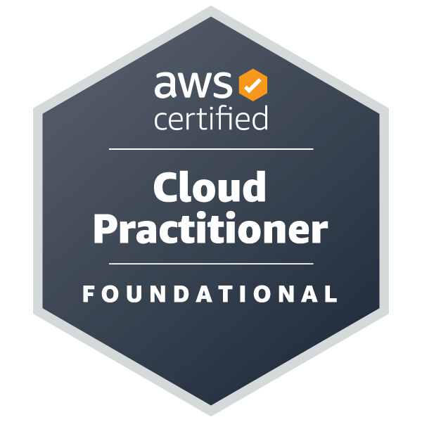
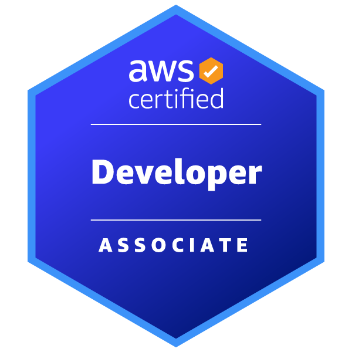
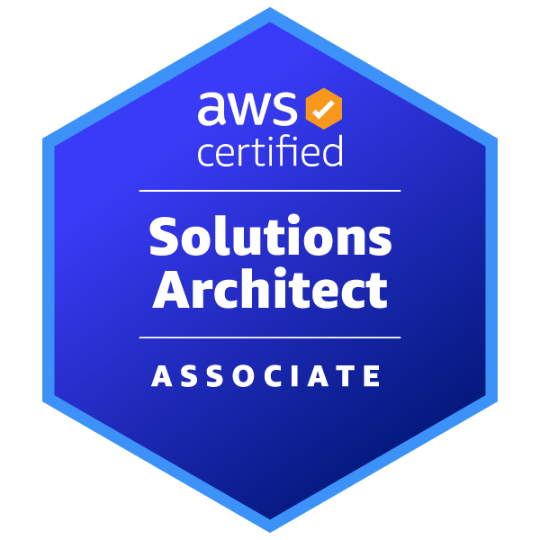

# Hi, I'm Albert 👋

## A passionate software engineer

- 🔭 I’m currently working on [Yu-Gi-Oh! Scraper](https://github.com/albert-marrero/Yu-Gi-Oh-Scraper)
- 👨‍💻 All of my projects are available at [https://github.com/albert-marrero?tab=repositories](https://github.com/albert-marrero?tab=repositories)
- 📫 How to reach me **contact@albertmarrero.me**
- ⚡ Fun fact **I enjoy playing board games**
- 🥅 2023 Goals:
    * Read 12 books
        1. [The Librarian of Crooked Lane](https://www.goodreads.com/book/show/60054210-the-librarian-of-crooked-lane) - C.J. Archer ✔️
        2. [The Vue](https://www.goodreads.com/book/show/19385238-the-vu) - Hannah Gray Gordon ⏳ 
    * AWS Certified Developer - Associate Recertification

### Connect with me:

[][website]
[][stack-overflow]

### Languages and Tools:
[][aws]
[][git]
[][postman]
[][python]
[][visual-studio-code]

### Certifications:
[][aws-certified-cloud-practitioner]
[][aws-certified-developer-associate]
[][aws-certified-solutions-architect-associate]

# 📊 GitHub Stats:
 
 

---

## 💰 You can help me by Donating
   

  
<!-- Proudly created with GPRM ( https://gprm.itsvg.in ) -->

[connect-with-me]: # (Connect with me List)
[stack-overflow]: https://stackoverflow.com/users/9119769
[website]: https://albertmarrero.me

[languages-and-tools]: # (Languages and Tools)
[aws]: https://aws.amazon.com
[git]: https://git-scm.com
[postman]: https://postman.com
[python]: https://www.python.org
[visual-studio-code]: https://code.visualstudio.com

[certifications]: # (Certifications)
[aws-certified-cloud-practitioner]: https://www.credly.com/badges/05ea333b-72ae-45fa-b096-7b69df7fa340/public_url
[aws-certified-developer-associate]: https://www.credly.com/badges/a9551805-5edb-4d66-98f9-db598039e7d3/public_url
[aws-certified-solutions-architect-associate]: https://www.credly.com/badges/7039f5a6-bb79-4eec-8902-8b37f6d5b082/public_url
